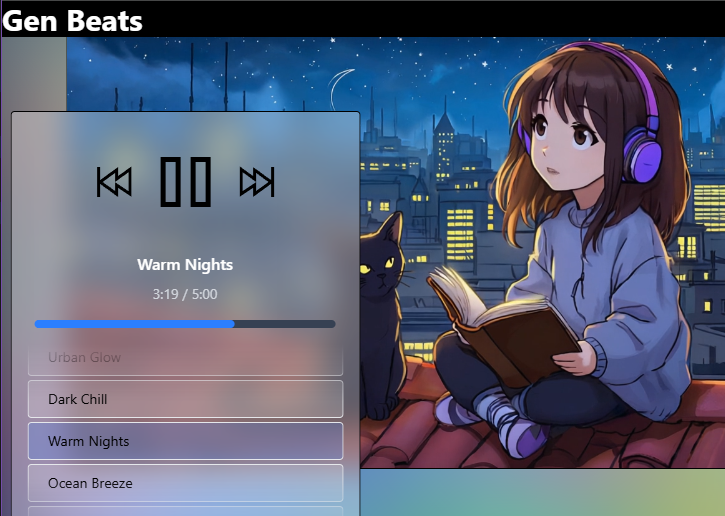

# 🎵 Gen Beats

  

  

---

## About

**Gen Beats** is the front end of a next-generation SaaS app that delivers AI-generated listening and visual experiences. This project is a fusion of cutting-edge music generation, real-time GPU-accelerated inference, and immersive visuals—all powered by modern web and AI technologies.

> _"I have built boutique music generation models in Torch Audio and implemented CUDA GPU acceleration for real-time inference. Using R2 for object storage, MongoDB for noSQL metadata, and FastAPI on EC2 for scalability. This app is in the early stages of development, but I am excited to see it unfold."_

---

## 🚀 Features

- 🎶 **AI-Generated Music**: Real-time, boutique music generation using custom PyTorch models
- 🎥 **AI Visuals**: Stable Video Diffusion and generative art for a unique visual experience
- ⚡ **Real-Time Inference**: CUDA GPU acceleration for seamless, low-latency playback
- ☁️ **Cloud-Native**: R2 object storage, MongoDB for metadata, FastAPI backend on EC2
- 🎛️ **Interactive UI**: Built with React, Framer Motion, and Tone.js for a smooth, modern experience

---

## 🛠️ Tech Stack

- **Frontend**: React, Framer Motion, Tone.js
- **Backend**: FastAPI (Python), EC2 (AWS)
- **AI/ML**: PyTorch CUDA, Torch Audio, Stable Video Diffusion
- **Storage**: R2 (Cloudflare), MongoDB (NoSQL)
- **Other**: TypeScript, TailwindCSS, Vite, and more

---

## 🌐 Live Demo

---

## 📸 Preview

  

---

## 💡 Vision

Gen Beats is in its early stages, but the vision is clear: to create a platform where AI and creativity meet, offering listeners and viewers a truly unique, generative experience. Stay tuned for more features, more music, and more magic!

---

## 🤝 Contributing

Pull requests and ideas are welcome! For major changes, please open an issue first to discuss what you would like to change.

---

## 📫 Contact

- [genbeats.com](https://genbeats.com)
- [Your Name or Team]
